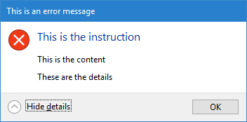
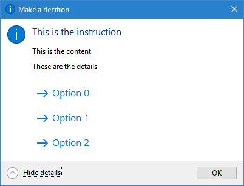

Using TaskDialogs in C#
===

Although Windows Vista and ComCtl32 6.0 has been around for more than a little white,
The [TaskDialog API](https://docs.microsoft.com/en-us/windows/desktop/api/commctrl/nf-commctrl-taskdialogindirect)
is still not being properly exposed to managed code. The 
_Windows API Code Pack_, which was once meant to be the official way to use
the API in managed code does not seem to be maintained anymore. There are several
open source wrapper libraries -- but they tend to be bloated, and adding a dependency
merely for being able to show a message box often seems inappropriate.

This sample project shows how you can use `TaskDialogIndirect` in C# with just
a little bit of P/Invoke wrapper code.

The code contains two examples:

**(1) Showing a message box with additonal detail information:**

**(2) Showing a message box that offers a choice:**

